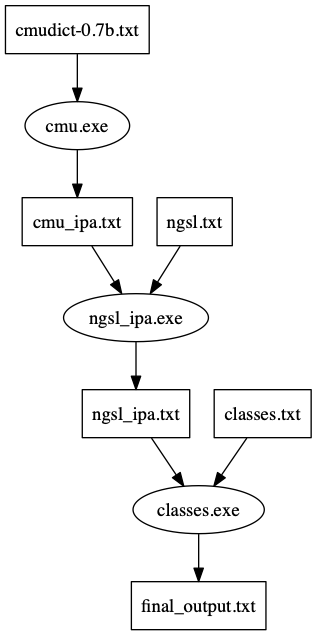

# Generation of Consonants Classes

## Project Structure

<a href="doc/Notes_on_Phonetic_Links_in_Vocabulary_Kmap.pdf">Workflow explanation. </a>



## Dependencies

- csc (C# Compiler)
- mono

## File Generation

```
> chmod +x run.sh
> ./run.sh build
```
